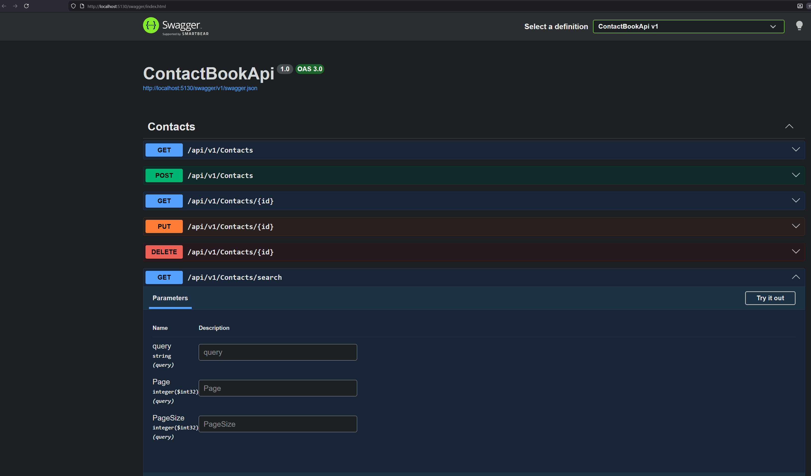

# ContactBook API

Simple REST API for managing a shared contact book.

---

## Features

- CRUD operations for contacts
- Paginated listing
- Search across name, phone, and email
- Input validation
- API versioning via `/api/v1`
- Swagger / OpenAPI
- SQLite for local development
- Integration tests with in-memory SQLite

---

## Tech Stack

- ASP.NET Core Web API
- Entity Framework Core
- SQLite
- AutoMapper
- Swagger (Swashbuckle)
- xUnit + WebApplicationFactory

---
Base path:

/api/v1


| Method | Endpoint | Description |
|------|---------|-------------|
| GET | `/contacts` | List contacts (paginated) |
| GET | `/contacts/{id}` | Get contact by ID |
| POST | `/contacts` | Create contact |
| PUT | `/contacts/{id}` | Update contact |
| DELETE | `/contacts/{id}` | Delete contact |
| GET | `/contacts/search` | Search contacts (paginated) |

---



# Running
## To run the API 
```
dotnet run --project ContactBookApi
```
## Swagger
http://localhost:5130/swagger/index.html


## Running tests
```
dotnet test
```

# To be improved if time permits
- Make a frontend
- Add more tests
- Add constrains about no duplicate emails
- Dockerize (3 containers in docker compose - BE, FE, DB)
- Swap SQLlite for postgres
- Map (custom) exceptions to http status codes in middleware so that services can just throw.
For example if not present in db, the service would throw EntityNotFound(), and 404 would be returned. This would get rid of the need to pass (return) values from the services back to the controller to decide about which http status code to return
- Pipeline to build and test
- If in overengineering mood, implement a caching layer


